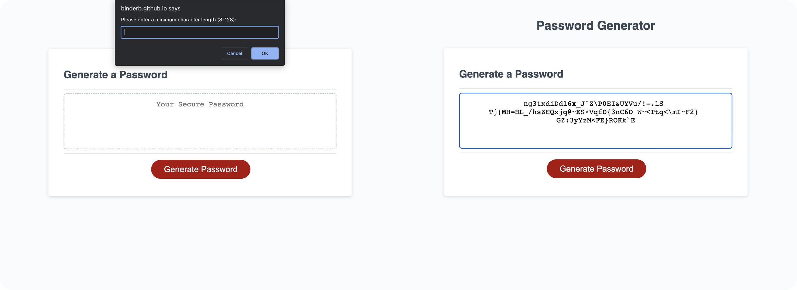

# Password Generator

## Description

A mobile-friendly JS-enabled website that generates a password based on criteria provided by the user. Includes the following features in accordance with the coding challenge guidelines:
- Use of `alert`, `confirm`, and `prompt` methods to gather information from the user.
- Options for the user including minimum/maximum desired length (within software-specified limits), and a choice of 4 different types of characters to include (lowercase, uppercase, numeric, and/or special).
- Robust validation of user input to ensure that no errors are thrown if the user enters invalid options. 
- Informative feedback messages if invalid input is detected, and a logical control flow that permits the user to fix mistakes.
- Generator function that can pick a random length for the password within user specifications, and composes the password with user-specified character types.
   

   

## Usage

The page can be viewed [here](https://binderb.github.io/password-generator/) on GitHub Pages. Clicking the **Generate Password** button will begin a series of modal prompts that will ask the user for their desired criteria. Criteria includes password minimum and maximum length, as well as a choice of lowercase, uppercase, numeric, and/or special characters. If invalid input is detected, the page will provide an informative feedback message and the user will be given the option to try again. When all prompts are answered with valid responses, the page will generate a password according to the specified criteria, and display it in the dashed box.

## Credits

Starter code, including the HTML/CSS for the page and a brief snippet of JavaScript that adds event listeners to UI elements was provided by the UofM Coding Bootcamp (Trilogy Education Services); all other JavaScript code was written by the developer.

## License

Please refer to the LICENSE in the repo.
